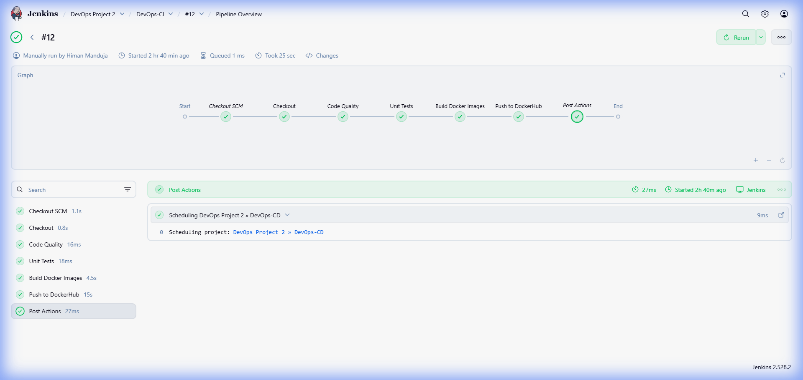
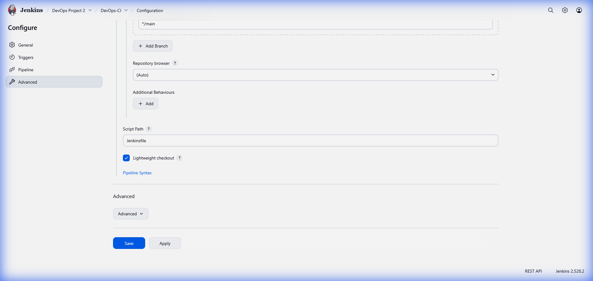
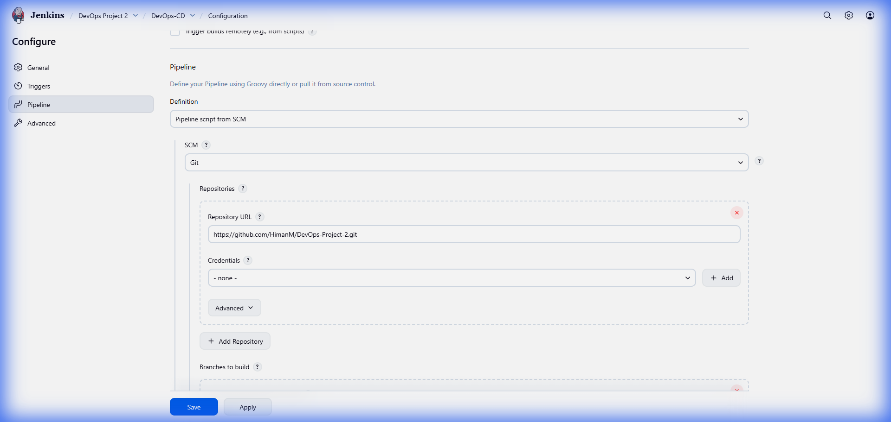
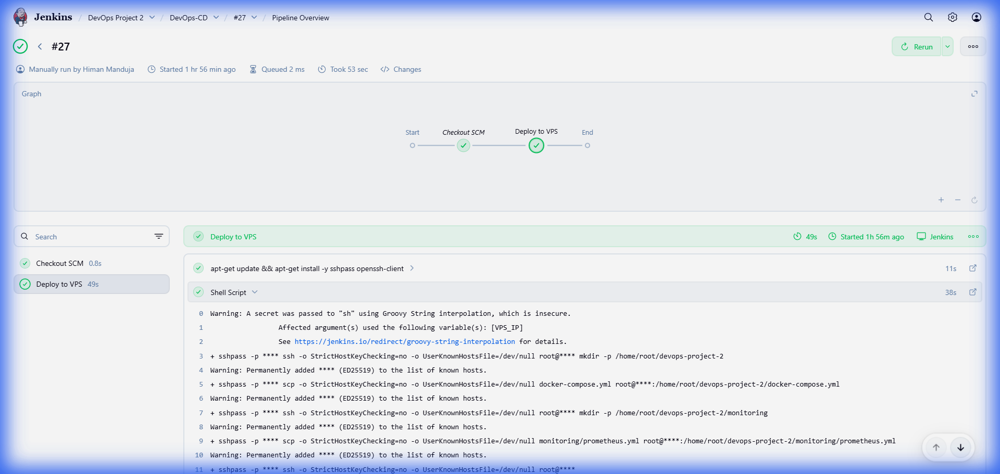
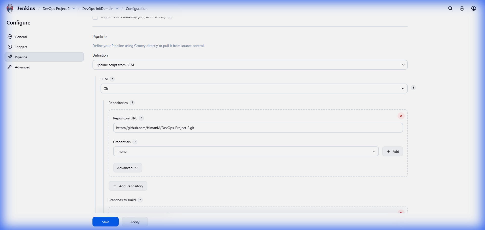
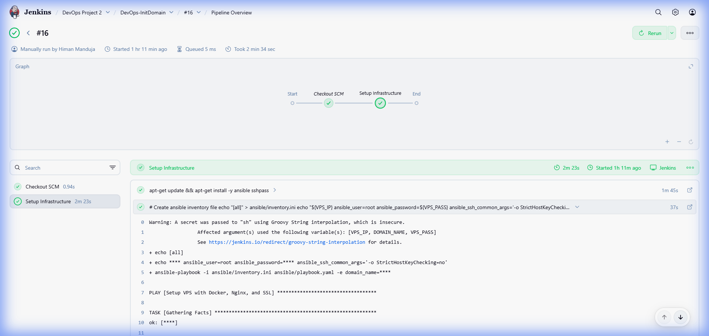

# DevOps Project 2


## Table of Contents

- [Overview](#overview)
- [Architecture](#architecture)
- [Technology Stack](#technology-stack)
- [CI/CD Pipeline Architecture](#cicd-pipeline-architecture)
- [Getting Started](#getting-started)
  - [Prerequisites](#prerequisites)
  - [Local Development](#local-development)
- [Jenkins Setup](#jenkins-setup)
  - [Installation](#installation)
  - [Plugin Configuration](#plugin-configuration)
  - [Credentials Management](#credentials-management)
  - [Pipeline Configuration](#pipeline-configuration)
- [Deployment](#deployment)
- [Monitoring](#monitoring)
- [Troubleshooting](#troubleshooting)
- [License](#license)

---

## Overview

This project is a comprehensive DevOps learning resource designed to demonstrate advanced CI/CD concepts, infrastructure automation, and containerization. It showcases a modern web application stack deployed through a robust, chained Jenkins pipeline architecture.

**Live Demo:** [https://devops2.himanmanduja.fun](https://devops2.himanmanduja.fun)  
**GitHub Repository:** [https://github.com/HimanM/DevOps-Project-2](https://github.com/HimanM/DevOps-Project-2)  
**Docker Hub:**
- Frontend: [himanm/devops-project-2-frontend](https://hub.docker.com/r/himanm/devops-project-2-frontend)
- Backend: [himanm/devops-project-2-backend](https://hub.docker.com/r/himanm/devops-project-2-backend)

---

## Architecture

The project implements a multi-stage CI/CD pipeline with automated infrastructure provisioning and deployment.

### Infrastructure Flow

1. **Code Push**: Developer commits code to GitHub repository.
2. **CI Pipeline (DevOps-CI)**: Jenkins detects changes, runs linting and tests, builds Docker images, and pushes to Docker Hub.
3. **CD Trigger**: Successful CI build automatically triggers the CD pipeline.
4. **CD Pipeline (DevOps-CD)**: Jenkins connects to VPS via SSH, pulls latest images, and restarts containers.
5. **Infrastructure Setup (DevOps-InitDomain)**: Ansible configures Nginx reverse proxy and SSL certificates.



---

## Technology Stack

### Frontend
- **Framework**: Next.js 14 (React)
- **Styling**: Tailwind CSS, Shadcn UI
- **Animation**: Framer Motion
- **Deployment**: Docker container (port 3000)

### Backend
- **Framework**: Python Flask
- **API**: RESTful endpoints with Prometheus metrics
- **Deployment**: Docker container (port 5000)

### Infrastructure
- **Containerization**: Docker, Docker Compose
- **Reverse Proxy**: Nginx (port 80 → 57002)
- **SSL**: Let's Encrypt (Certbot)
- **CI/CD**: Jenkins (chained pipelines)
- **Configuration Management**: Ansible
- **Monitoring**: Prometheus, Grafana

---

## CI/CD Pipeline Architecture

This project uses a **chained pipeline architecture** with three distinct Jenkins jobs.

### 1. DevOps-CI (`Jenkinsfile`)

**Purpose**: Continuous Integration - builds and publishes Docker images.

**Trigger**: GitHub webhook on push to main branch.

**Stages**:
1. **Checkout**: Pulls source code from GitHub.
2. **Code Quality**: Runs ESLint on frontend code.
3. **Unit Tests**: Executes pytest for backend validation.
4. **Build Docker Images**: Builds frontend and backend containers.
5. **Push to DockerHub**: Publishes images to Docker Hub registry.
6. **Trigger CD**: Automatically triggers DevOps-CD on success.

**Jenkinsfile Path**: `Jenkinsfile`

---

### 2. DevOps-CD (`Jenkinsfile.deploy`)

**Purpose**: Continuous Deployment - deploys application to production VPS.

**Trigger**: Upstream job (DevOps-CI) success.

**Stages**:
1. **SSH Connection**: Establishes connection to VPS.
2. **Prepare Environment**: Creates project directory structure.
3. **Pull Images**: Downloads latest Docker images from registry.
4. **Deploy**: Executes `docker compose up -d` to restart services.

**Jenkinsfile Path**: `Jenkinsfile.deploy`

---

### 3. DevOps-InitDomain (`Jenkinsfile.initdomain`)

**Purpose**: Infrastructure as Code - configures web server and SSL.

**Trigger**: Manual (one-time setup or domain changes).

**Stages**:
1. **Install Ansible**: Ensures Ansible is available on Jenkins agent.
2. **Run Playbook**: Executes Ansible configuration.
3. **Configure Nginx**: Sets up reverse proxy (port 80 → 57002).
4. **SSL Certificates**: Generates Let's Encrypt certificates for HTTPS.

**Jenkinsfile Path**: `Jenkinsfile.initdomain`

---

## Getting Started

### Prerequisites

- **Docker**: Version 20.10 or higher
- **Docker Compose**: Version 2.0 or higher
- **Node.js**: Version 18 or higher (for local frontend development)
- **Python**: Version 3.9 or higher (for local backend development)

### Local Development

1. **Clone the repository**:
   ```bash
   git clone https://github.com/HimanM/DevOps-Project-2.git
   cd DevOps-Project-2
   ```

2. **Start services with Docker Compose**:
   ```bash
   docker compose up --build
   ```

3. **Access the application**:
   - **Frontend**: http://localhost:3000
   - **Backend API**: http://localhost:5000
   - **Grafana Dashboard**: http://localhost:3001 (admin/admin)
   - **Prometheus**: http://localhost:9090

---

## Jenkins Setup

### Installation

Follow these steps to install Jenkins on Ubuntu/Debian systems.

#### Step 1: Install Java

Jenkins requires Java Runtime Environment. OpenJDK 17 is recommended.

```bash
sudo apt update
sudo apt install fontconfig openjdk-17-jre
java -version
```

#### Step 2: Add Jenkins Repository

```bash
sudo wget -O /usr/share/keyrings/jenkins-keyring.asc \
  https://pkg.jenkins.io/debian-stable/jenkins.io-2023.key

echo "deb [signed-by=/usr/share/keyrings/jenkins-keyring.asc] \
  https://pkg.jenkins.io/debian-stable binary/" | sudo tee \
  /etc/apt/sources.list.d/jenkins.list > /dev/null
```

#### Step 3: Install Jenkins

```bash
sudo apt-get update
sudo apt-get install jenkins
```

#### Step 4: Start Jenkins Service

```bash
sudo systemctl enable jenkins
sudo systemctl start jenkins
sudo systemctl status jenkins
```

#### Step 5: Unlock Jenkins

Retrieve the initial admin password:

```bash
sudo cat /var/lib/jenkins/secrets/initialAdminPassword
```

Navigate to `http://<your-server-ip>:8080` and enter the password to complete setup.

---

### Plugin Configuration

Navigate to **Manage Jenkins > Plugins > Available Plugins** and install the following:

| Plugin Name | Purpose |
|------------|---------|
| **Docker** | Build and manage Docker containers |
| **Docker Pipeline** | Use Docker commands in pipeline scripts |
| **Pipeline: Stage View** | Visualize pipeline execution stages |
| **Ansible** | Execute Ansible playbooks (optional) |

After installation, restart Jenkins if prompted.

---

### Credentials Management

Navigate to **Manage Jenkins > Credentials > System > Global credentials (unrestricted)**.

Create the following credentials:

| ID | Kind | Description | Example Value |
|----|------|-------------|---------------|
| `dockerhub-username` | Username with password | Docker Hub authentication | Username: `himanm`<br>Password: `<access-token>` |
| `vps-credentials` | Username with password | VPS SSH access | Username: `root`<br>Password: `<server-password>` |
| `vps-ip` | Secret text | VPS IP address | `165.22.54.216` |
| `DEVOPS2_DOMAIN` | Secret text | Domain name | `devops2.himanmanduja.fun` |


**Important Notes**:
- For Docker Hub, use an **Access Token** instead of your password. Generate one at [Docker Hub Security Settings](https://hub.docker.com/settings/security).
- Ensure the VPS user has Docker permissions: `sudo usermod -aG docker <username>`

---

### Pipeline Configuration

#### Creating DevOps-CI Pipeline

1. Click **New Item** in Jenkins dashboard.
2. Enter name: `DevOps-CI`
3. Select **Pipeline** and click OK.
4. Under **Pipeline** section:
   - **Definition**: Pipeline script from SCM
   - **SCM**: Git
   - **Repository URL**: `https://github.com/HimanM/DevOps-Project-2.git`
   - **Branch**: `*/main`
   - **Script Path**: `Jenkinsfile`
5. Click **Save**.

**Configuration Screenshot**:


**Pipeline Stages**:


---

#### Creating DevOps-CD Pipeline

1. Click **New Item** in Jenkins dashboard.
2. Enter name: `DevOps-CD`
3. Select **Pipeline** and click OK.
4. Under **Build Triggers**:
   - Check **Build after other projects are built**
   - Projects to watch: `DevOps-CI`
   - Trigger only if build is stable
5. Under **Pipeline** section:
   - **Definition**: Pipeline script from SCM
   - **SCM**: Git
   - **Repository URL**: `https://github.com/HimanM/DevOps-Project-2.git`
   - **Branch**: `*/main`
   - **Script Path**: `Jenkinsfile.deploy`
6. Click **Save**.

**Configuration Screenshot**:


**Pipeline Visualization**:


---

#### Creating DevOps-InitDomain Pipeline

1. Click **New Item** in Jenkins dashboard.
2. Enter name: `DevOps-InitDomain`
3. Select **Pipeline** and click OK.
4. Under **Pipeline** section:
   - **Definition**: Pipeline script from SCM
   - **SCM**: Git
   - **Repository URL**: `https://github.com/HimanM/DevOps-Project-2.git`
   - **Branch**: `*/main`
   - **Script Path**: `Jenkinsfile.initdomain`
5. Click **Save**.

**Configuration Screenshot**:


**Pipeline Visualization**:


---

## Deployment

### Initial Setup

1. **Run Infrastructure Pipeline**:
   - Manually trigger `DevOps-InitDomain` job.
   - This configures Nginx and SSL certificates (one-time setup).

2. **Trigger CI Pipeline**:
   - Push code to GitHub repository, or
   - Manually trigger `DevOps-CI` job.

3. **Automatic Deployment**:
   - Upon successful CI build, `DevOps-CD` automatically deploys to VPS.

### Deployment Verification

After deployment, verify the application:

```bash
# SSH into VPS
ssh root@<vps-ip>

# Check running containers
docker ps

# View logs
docker logs devops-project-2-frontend-1
docker logs devops-project-2-backend-1
```

---

## Monitoring

The project includes a pre-configured monitoring stack.

### Prometheus

- **URL**: `http://<vps-ip>:9090`
- **Configuration**: `monitoring/prometheus.yml`
- **Metrics Endpoint**: Backend exposes metrics at `/metrics`

### Grafana

- **URL**: `http://<vps-ip>:3001`
- **Default Credentials**: `admin` / `admin`
- **Data Source**: Pre-configured Prometheus connection
- **Dashboards**: Import from `monitoring/grafana/dashboards/`

---

## Troubleshooting

### Common Issues

#### Docker Permission Denied

**Error**: `permission denied while trying to connect to the Docker daemon socket`

**Solution**:
```bash
sudo usermod -aG docker jenkins
sudo systemctl restart jenkins
```

#### SSH Host Key Verification Failed

**Error**: `Host key verification failed`

**Solution**: The pipelines use `-o StrictHostKeyChecking=no` to bypass this. If issues persist, manually SSH once:
```bash
ssh root@<vps-ip>
```

#### Nginx 502 Bad Gateway

**Error**: Nginx returns 502 error

**Solution**:
```bash
# Check if backend container is running
docker ps | grep backend

# Check backend logs
docker logs devops-project-2-backend-1

# Restart containers
cd ~/devops-project-2
docker compose restart
```

#### Jenkins Build Fails on npm install

**Error**: `EACCES: permission denied`

**Solution**: Ensure Jenkins agent has Node.js installed or use Docker agent in Jenkinsfile.

---

## License

This project is for educational purposes. Feel free to use and modify for learning.

---

**Author**: HimanM  
**Repository**: [github.com/HimanM/DevOps-Project-2](https://github.com/HimanM/DevOps-Project-2)  
**Live Demo**: [devops2.himanmanduja.fun](https://devops2.himanmanduja.fun)
